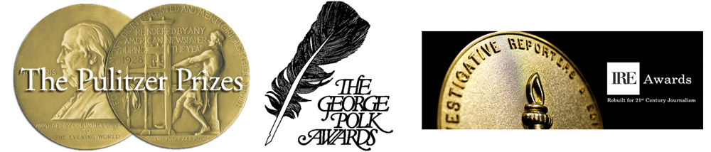

# About

---
At the International Consortium of Investigative Journalists we want to inspire and cultivate a global community of reporters and readers who believe journalism can bring about positive change.

---

ICIJ is a [unique organization](https://www.icij.org/about/icijs-story/). A U.S.-based nonprofit, we are both a **small, resourceful newsroom** with our own reporting team, as well as a **global network of reporters and media organizations** who work together to investigate the most important stories in the world.

Our network of [trusted members](https://www.icij.org/journalists/) encompasses more than **220 of the best investigative reporters from 83 countries and territories**. We also partner with more than 100 [media organizations](https://www.icij.org/about/media-partners/), from the world’s most renowned outlets, including the BBC, the New York Times, the Guardian and the Asahi Shimbun, to small regional nonprofit investigative centers.

Drawing on the expertise and reach of our network, we **collaborate on groundbreaking investigations** that expose the truth and hold the powerful accountable, while also adhering to the [highest standards](https://www.icij.org/about/corporate/) of fairness and accuracy.

The ICIJ core team is small, but ambitious. We want to empower our readers to engage with their local communities about issues of global importance, such as broken systems and abuses of power. And we want to do that by harnessing the **enormous strength of our extensive network**.

In addition to our U.S. staff, we have team members in Australia, France, Costa Rica, Spain, Hungary, Germany and England.

We are passionate about the power of journalism and **provide the tools and guidance needed** to successfully pull off unprecedented reporting collaborations.

Over the years, ICIJ has released dozens of [investigations](https://www.icij.org/investigations/) – including the Pulitzer Prize-winning [Panama Papers](https://www.icij.org/panamapapers) – and we have won many [awards](https://www.icij.org/about/awards/) for our work.

ICIJ is fully [funded by donations](https://www.icij.org/donate). You can read more [about our supporters here](https://www.icij.org/about/our-supporters/), and [explore the impact of our work here](https://www.icij.org/tags/impact).

ICIJ encourages [tips, leaks and story ideas from the public](https://www.icij.org/leak), whistleblowers, as well as from outstanding investigative journalists interested in collaborating with us. Please don’t hesitate to [contact us](https://www.icij.org/leak) with your ideas.

If you are a journalist and want to be considered for ICIJ membership please [send us](mailto:contact@icij.org) your CV and clips.
