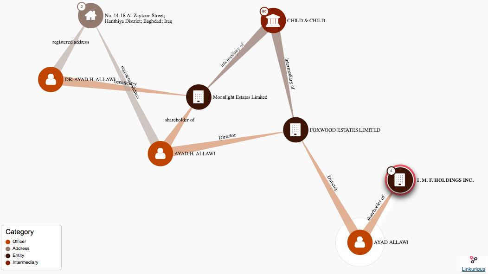

# How to use the Offshore Leaks Database

## Tips to make the most of the data

The ICIJ Offshore Leaks database allows you to search through more than 785,000 offshore companies and trusts – more than 200,000 were registered by the Panamanian law firm Mossack Fonseca, whose inner workings were exposed in the [Panama Papers](https://panamapapers.icij.org/), and 100,000 entities incorporated through Portcullis Trustnet and Commonwealth Trust Limited, two offshore service providers exposed as part of the [2013 ICIJ Offshore Leaks investigation](https://www.icij.org/offshore).

The largest collection of entities comes from the [Paradise Papers](https://www.icij.org/investigations/paradise-papers/) investigation. Between November 2017 and February 2018 ICIJ added more than 290,000 records from offshore law firm Appleby and seven corporate registries: Aruba, Bahamas, Barbados, Cook Islands, Malta, Nevis and Samoa.

The Offshore Leaks database offers users multiple ways to explore the data, including searching by names or keywords, looking for country-specific connections or browsing offshore entities by jurisdiction.

## Find a specific person or company

Let’s say you are researching property ownership in a city like London and come across an offshore company listed as an owner of a £750,000 commercial building in the British Land Registry. The registry does not tell you who is actually behind the company “Moonlight Estates Limited.”

But the Offshore Leaks database might be able to help. Start by typing the “Moonlight Estates” into the search box and hit “Search.” Typing only the first part of the company name will show partial matches, so it won’t matter if “Limited” is spelled “Ltd” or “Ltd.” in the data. As a general rule, we encourage you to try different spellings when looking for a person of a company.

The results page returns one company named “Moonlight Estates Limited,” connected to Ecuador and registered in the British Virgin Islands. Had the results page returned several companies with the name “Moonlight Estates Limited,” you could have filtered by jurisdiction, for example by clicking on “British Virgin Islands” in the right menu.

Clicking on the company’s name will lead you to a page with more information about that company and who’s behind it. In addition to basic information about the company, you’ll also see an interactive visualization that allows you to explore the connections between this company and related addresses, shareholders, beneficiaries and more. There’s also a text list of these connections and links out to OpenCorporates (for additional corporate data).

Take a look at the visualization, and you’ll see that the shareholder and beneficiary of “Moonlight Estates Limited” is actually [Ayad H. Allawi](http://www.theguardian.com/news/2016/apr/05/panama-papers-world-leaders-tycoons-secret-property-empires), the former prime minister of Iraq.

Clicking on the beneficiary node shows the address connected to Allawi, which enables you to check if it is indeed the former prime minister. Clicking on the shareholder node shows you another company for which Allawi is a listed shareholder, “Foxwood Estates Limited.”

If you check the British Land Registry, you can see that Foxwood Estates Limited owns a townhouse worth £2.75m in Kensington. Clicking on Foxwood Estates Limited in the visualization will reveal that another director for this company is “Ayad Allawi” (without an H), also connected to another company.

Of course, if you already knew that Allawi was in the Panama Papers data, you could also have found his name by typing it into the search box. On the database’s landing page select the “Search by country” tab (the “Search by jurisdiction” tab is for company searches only, not for individuals), type in “Ayad Allawi” and click “Search.”

The results page lists all the officers with that name. From the results page you can already see which countries those officers are connected to.

When you click on the name, you get information and a visualization showing the connections between Ayad Allawi and different addresses and offshore entities. Clicking on the different nodes will enable you to find all the information you previously found by starting with the company search.

One final tip when searching for a specific name: ICIJ is publishing the names as they were typed in the leaked records. This means that there could be multiple spellings or even misspellings in how names are listed. We encourage you to try different spellings.

## Find all the names connected to a country

ICIJ connected the names of individuals and offshore entities in the database to more than 200 countries and territories through their listed addresses. This way, if a person is the beneficial owner of a company and is connected to an address in France, the person will appear if you search for all the names associated with France.

To do that, make sure you are in the tab entitled “Search by country.” Open the drop-down menu by clicking on “All countries” and select the country you are looking for, in this case France. Leave the search box blank and hit “Search.”

The search results are displayed in sections: you can see the offshore entities (these are the companies, trusts, foundations and more), the officers (which includes directors, shareholders and/or beneficiaries), intermediaries (the lawyers and service providers who help set up or act as the registered agents for the offshore companies), and the addresses connected to that country.

In the case of offshore entities, you can also add a second filter to focus on companies from a specific jurisdiction. Select the jurisdiction from the list in the right menu. For example, if you search for “France” and then filter by the jurisdiction “Bahamas,” you will see all the companies connected to France that are registered in the Bahamas.

If you select the filter “Officers,” you’ll be able to see all the people connected to France. For example former minister Jérôme Cahuzac.

Clicking on his name will reveal that he is connected to the company “Cerman Group Limited” in the Panama Papers data.

## Browse by jurisdiction

Is there a particular tax haven or secrecy jurisdiction you’re curious about? You can browse all the companies registered in one of 38 jurisdictions included in our data using the “Search by jurisdictions” tab on the homepage of the database. Click on the tab, then select the jurisdiction from the drop-down menu. Leave the search box blank and hit “Search.”

You can browse the list of offshore entities and can click through to find out more information about their offshore connections.

You can also switch between the jurisdictions using the “Filter by jurisdiction” menu on the right menu. Visit our special Panama Papers blog post for more information about how secretive some of these jurisdictions are.

We encourage you to be careful when describing the information contained in this database. There are legitimate uses for offshore companies and trusts, and we do not intend to suggest or imply that any people, companies or other entities have broken the law or otherwise acted improperly. In addition, many people and entities have the same or similar names. We suggest you confirm the identities of any individuals or entities located in the database based on addresses or other identifiable information.

In addition to using the online Offshore Leaks database, you can also download the full dataset and explore all the data on your computer. We are making the raw data available for download [here](https://offshoreleaks.icij.org/pages/database).

ICIJ has been investigating the offshore economy for more than four years, and we’re going to keep digging into these leaked files. We welcome any tips you may find searching this database. Please send them to us [here](https://offshoreleaks.icij.org/tips/new). If you wish to use a more secure method to contact us or want to share sensitive information, please consider using an alternative method, such as encrypted email or Secure Drop. More details are available [here](https://www.icij.org/securedrop).
